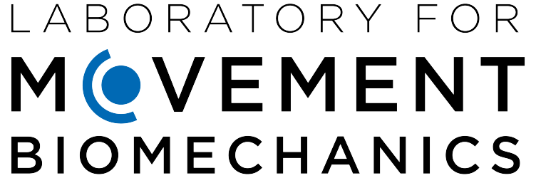

# Veriserum (Ongoing)

**Veriserum**: A dual-plane fluoroscopic dataset with implant phantoms for deep learning in medical imaging.

Authors: Jinhao Wang, Florian Vogl, William R.Taylor;

Address:
Institut für Biomechanik
Gloriastrasse 37/ 39
8092 Zürich
Switzerland

NB: The relevant paper is not yet published. If you are interested please contact first author. After open publication, you may cite the paper and free to use the dataset.

## Original data to download:

https://doi.org/10.3929/ethz-b-000701146
- original images
- sqlite3 database for all poses: veriserum original target pose (from patients' data), refined true pose (by automated registration), and 390 manually matched pose.
## Overview

Veriserum is an open-source dataset specifically designed for advancing deep learning in medical imaging, particularly in fluoroscopic image analysis. This dataset provides dual-plane fluoroscopic images with implant phantoms, enabling researchers to explore applications in biomechanics, computer vision, and pose estimation. Veriserum is freely available to support research communities in developing and testing algorithms in areas like 2D/3D image registration, X-ray distortion calibration, segmentation, and 3D reconstruction.

### Key Features
- **Dual-Plane Fluoroscopy**: Paired images from two perspectives facilitate 3D reconstruction and pose estimation.
- **Implant Phantoms**: Redesigned Synthetic implant structures allow for detailed testing of algorithms.
- **Pre-calibrated Images**: The images are standardized in size and intensity, ready for direct application with common deep learning models.
- **Open Source**: Free for academic and research use, promoting transparency and collaboration.

## Directory Structure
Please download the original imageset and the sqlite3 database into the Veriserum project repository. 

The project directory is organized as follows:

```plaintext
project_directory/
├── model.py                  # Defines the PoseEstimationModel
├── train.py                  # Contains data loading and training logic
├── veriserum_dataset.py      # Defines the custom Veriserum_calibrated dataset
├── sampler.py                # Defines the custom NonObsoleteSampler
├── csv_files/
│   ├── veriserum_pose_reloaded_refined_all.csv
│   ├── distortion_calibration_reloaded.csv
│   └── source_int_calibration_reloaded.csv
```

### Directory and File Descriptions

- **model.py**: Contains `PoseEstimationModel`, a model that utilizes a pre-trained ResNeXt backbone to perform pose estimation on fluoroscopic images.
- **train.py**: Includes data loading, augmentation, and model training using PyTorch Lightning. Configures training/validation splits, logging, and model checkpointing.
- **veriserum_dataset.py**: Defines `Veriserum_calibrated`, a custom PyTorch dataset class that loads dual-plane fluoroscopic images, calibrates them if needed, and retrieves corresponding pose data.
- **sampler.py**: Implements `NonObsoleteSampler`, which filters data based on specific conditions (e.g., removing obsolete entries) to ensure high-quality samples.
- **csv_files/**: Contains calibration and pose data files (all extracted from sqlite3 database):
  - `veriserum_pose_reloaded_refined_all.csv`: Ground truth Pose data for each image, obtained by a Pytorch3d automated 2d/3d image registration program.
  - `distortion_calibration_reloaded.csv`: Distortion calibration data for correcting images.
  - `source_int_calibration_reloaded.csv`: Calibration data for source intensifiers.

- **test_cases.py**: simple testcases for veriserum dataset, calibrations, and image acquisition. 
- **sqlite3 databse**: Contains the database structure storing veriserum original target pose (from patients' data), refined true pose (by automated registration), and 390 manually matched pose. All pose data is in Table 'Poses'. 
## Setup and Installation

1. **Clone the repository**:

    ```bash
    git clone https://github.com/yourusername/veriserum.git
    cd veriserum
    ```

2. **Install dependencies**: This project requires Python 3.8+ and PyTorch. Install required packages with:

    ```bash
    pip install -r requirements.txt
    ```

3. **Data Preparation**: 

In `veriserum_dataset.py`, I provided a simple pytorch module for correct calibration and deep learning. If `calibration_on_time` is True, calibration is done with the data generation but I strongly not recommend this for deep learnign as each image takes around 7 seconds to be calibrated. Instead, I strongly suggest generate calibrated images before building and testing your DL networks. In doing so:
- Modify the image path in `veriserum_dataset.py` to your download original veriserum image path and change the output path in  `calibrate_image.py` to your desired output image path for calibrated images. Change the total image number of calibrated images that you want to produce in `calibrate_image.py`
- Run `calibrate_image.py` for a long time to generate enough images.
- In `train.py`, a simple pytorch-lightning based training code is provided. You may change the training settings or models in `model.py` to customize your DL networks. 

## Usage

### Training the Model

To train the model on Veriserum:

1. Configure training parameters (e.g., batch size, learning rate) in `train.py`.
2. Run the training script:

    ```bash
    python train.py
    ```

This will train the `PoseEstimationModel` and save the best model checkpoint based on validation loss.

### Customizing Data Loading and Transformations

The `Veriserum_calibrated` class in `veriserum_dataset.py` can be customized to apply specific transformations or adjust the calibration on-the-fly.
`train.py` also provides a template for augmenting the dataset with additional transformations, using the PyTorch `torchvision.transforms` module.

## Contributing

Contributions are welcome! If you find any issues or have ideas for improvements, please open an issue.

## License
In Copyright - Non-Commercial Use Permitted.

This project is licensed under the MIT License. All rights regarding the code's intellectual property, patents, and interpretations are reserved by the Laboratory of Movement Biomechanics, Institute for Biomechanics, D-HEST, ETH Zurich. Any unauthorized use beyond the scope of this license must be approved by the laboratory. 

## Acknowledgements

Special thanks to collaborators in LMB ETHz group members and institutions supporting open data initiatives and ETHz Research Collection team.
